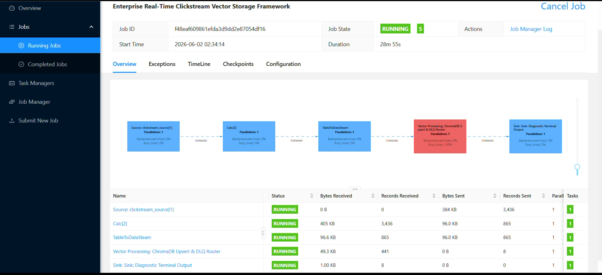

# 🚀 Enterprise Real-Time Clickstream & AI Context Engine

## 📖 Overview
**What does this project do?** Imagine a busy e-commerce website where thousands of users are clicking, browsing, and buying every second. This pipeline acts as a high-speed, intelligent conveyor belt. It captures those raw clicks the exact millisecond they happen, filters out the noise, translates the high-value purchases into a "semantic memory," and securely stores them so downstream Artificial Intelligence (AI) recommendation models can query user behavior contextually.

**Why does this matter?**
Legacy systems process behavioral data in nightly batches. This architecture guarantees **sub-second reaction times**, allowing downstream LLMs and recommender systems to retrieve localized vector embeddings dynamically while the user is still active in the session.

---

## 🏗️ Architecture & Execution Topologies

*💡 [Click here to view the live processing video snippet](./assets/20260602-0702-58.8399530.mp4)*

### The Core Infrastructure
1. **The Ingest (Producer):** A Python-based mock generator continuously blasts simulated user traffic into our message broker, deliberately injecting structural anomalies (e.g., malformed strings) to validate system resilience under chaos.
2. **The Broker (Apache Kafka):** An indestructible message queue organizing the massive data influx via localized Docker containers.
3. **The Brain (Apache Flink):** A real-time stream processor executing SQL-based filtering and custom Python flat-mapping directly inside the active job loop.
4. **The AI Memory (ChromaDB):** High-value events are transformed into semantic vector embeddings and stored inside a local vector abstraction layer (`chroma_vault`).

### ⚙️ Operational Scaling & Parallelism
**Local Deployment Context:** As depicted in the Flink Web UI screenshot, this localized Docker deployment executes under a **Strict Sequential Topology (Parallelism = 1)**. This single-core allocation is intentional for local state debugging, preventing thread collision during in-memory DLQ file locking on Windows architectures. 

**Production Scale-Out:** In a production Kubernetes deployment, this pipeline scales out horizontally. Flink's parallelism factor would be unbound, dynamically allocating multi-core TaskManagers to process Kafka partitions in parallel, while the ChromaDB sink logic scales behind a unified load balancer.

---

## 🛡️ Enterprise Resiliency Features
This system was engineered to survive the harsh realities of distributed production environments:
* **Dead Letter Queues (DLQ):** The custom `Vector Processing: ChromaDB Upsert & DLQ Router` node safely isolates malformed payloads into timestamped filesystem vaults (`/dlq_vault`), ensuring the core stream graph never crashes.
* **Idempotent Upserts:** If the network stutters and Kafka resends a batch, the pipeline uses deterministic UUID hashing to prevent duplicate embeddings from corrupting the AI context vector space.
* **Micro-Batch Telemetry:** To avoid slow, row-by-row I/O bottlenecks, the system features an in-memory buffer that executes vector database writes dynamically. Processing latency and throughput rates are emitted via realtime telemetry.

---

## 🚀 Quickstart Guide

Want to run this entire pipeline on your local machine?

**1. Clone the repository and navigate to the directory.**

**2. Boot up the Dockerized infrastructure (Kafka & Flink):**
  
docker-compose up -d

**3. Set up the Python Environment:**
python -m venv .venv

.\.venv\Scripts\activate

pip install pyflink chromadb faker confluent-kafka

**4. Launch the Pipeline (Requires Two Terminals):**
Terminal 1 (Traffic Generator): python src/producer.py

Terminal 2 (Flink Processor): python src/processor.py

**5. View the Live Dashboards:**
Kafka Message Queue UI: http://localhost:8080

Live Flink Processing DAG: http://localhost:8083

##  🗺️ Project Roadmap
[x] Phase 1: Real-Time Data Ingestion (Continuous Python payload generation to Kafka)

[x] Phase 2: Stream Processing (Apache Flink SQL filtering and stream compilation)

[x] Phase 3: AI Context Storage (In-memory ChromaDB vector upserts)

[x] Phase 4: Enterprise Hardening (Dead Letter Queues, telemetry, and exactly-once execution logic)

[ ] Phase 5: Downstream LLM Integration (Future: Connect an OpenAI chatbot to read the ChromaDB contexts)