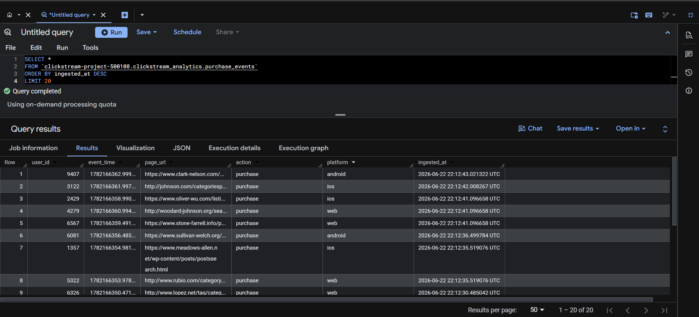
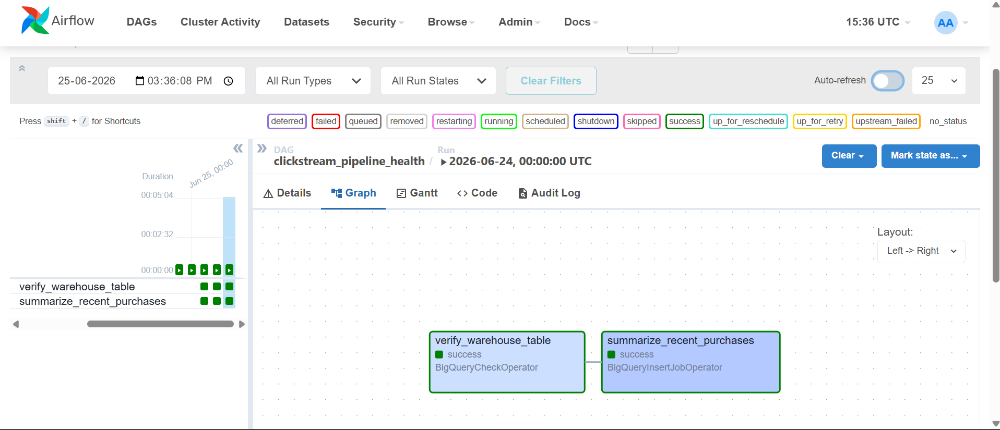
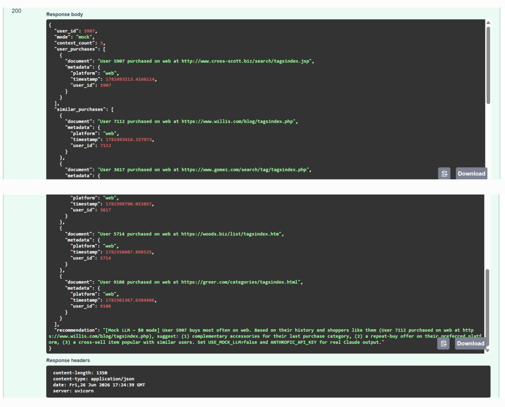

# Real-Time Clickstream & AI Context Pipeline


## Overview

I built this project to practice a full real-time data pipeline: simulated e-commerce clickstream events flow through Kafka, get filtered and validated, then land in two places at once — **ChromaDB** for vector search and **Google BigQuery** for SQL analytics. A FastAPI layer on top reads the vector store and returns purchase recommendations.

The pattern is a **dual-fork**: one event stream, two downstream consumers with different jobs (ML context vs. warehouse reporting). Everything runs locally with Docker except BigQuery, which uses Google's free sandbox tier.

---

## Architecture

```
Producer  →  Kafka  →  Processor  →  ┬─→  ChromaDB   (vector store)
(events)    (queue)   (filter +      │       ↓
                       validate)      │   Recommendation API
                                      │       ↓
                                      │   Mock / Claude
                                      └─→  BigQuery   (warehouse)
                                              ↑
                                              │
                                    Airflow (daily health check)
```

### Components

1. **Producer** (`src/producer.py`) — generates clickstream events with Faker and publishes to Kafka. Roughly 3% of records are intentionally malformed to exercise the dead-letter path.

2. **Kafka** — buffers events between producer and processor so short processor restarts do not lose data.

3. **Processor** (`src/processor.py`) — consumes the stream, keeps purchase events, validates them, and writes each batch to ChromaDB and BigQuery. Bad records go to `src/dlq_vault/`.

4. **ChromaDB** — stores purchase documents for similarity search (`src/chroma_vault/`, collection `realtime_user_contexts`).

5. **BigQuery** — stores structured rows in `clickstream_analytics.purchase_events`.

6. **Airflow** — daily DAG in `dags/` that checks the warehouse table is reachable and summarizes recent ingest volume. Producer and processor still run as local Python processes.

7. **Recommendation API** (`src/recommendation_api.py`) — FastAPI service on port 8090. Pulls a user's purchase history from ChromaDB, finds similar shoppers, and returns a recommendation. Defaults to a local mock response; optional Claude integration via `.env`.

### Verified output — BigQuery



---

## Orchestration (Airflow)

I added Airflow to schedule warehouse monitoring instead of checking BigQuery manually.

| Piece | Role |
|-------|------|
| `airflow-postgres`, `airflow-init`, `airflow` in `docker-compose.yml` | Metadata DB, one-shot setup, scheduler + UI |
| `dags/clickstream_pipeline_health.py` | Daily DAG with two tasks |
| `google_cloud_default` connection | Wired in compose to the mounted GCP key |

**DAG tasks** (run in order):

1. `verify_warehouse_table` — BigQuery table responds
2. `summarize_recent_purchases` — row count and latest `ingested_at` for the last 24 hours



**Run it:**

```bash
docker-compose up -d
# UI: http://localhost:8088  (admin / admin)
# Unpause clickstream_pipeline_health, then trigger or wait for @daily
```

`clickstream-airflow-init` exiting after startup is normal — it only migrates the DB and creates the admin user.

| Service | URL |
|---------|-----|
| Airflow | http://localhost:8088 |
| Kafka UI | http://localhost:8080 |
| Flink UI | http://localhost:8081 |
| Kafka broker (apps) | `localhost:9092` — not a browser URL |

---

## Recommendation API

The last piece reads ChromaDB and returns suggestions for a given `user_id`.

**Flow:** `POST /recommendations` → load user purchases → vector search for similar buyers → mock or Claude response.



**Run it** (after producer + processor have written to ChromaDB):

```bash
cp .env.example .env    # optional; mock mode works without changes
pip install -r requirements.txt
uvicorn src.recommendation_api:app --reload --port 8090
```

| Endpoint | Purpose |
|----------|---------|
| http://localhost:8090/docs | Swagger UI |
| `GET /health` | API + ChromaDB document count |
| `GET /users/{user_id}/context` | Raw purchase + similar context |
| `POST /recommendations` | Recommendation JSON |

**LLM modes:** `USE_MOCK_LLM=true` (default) runs locally with no API key. Set `USE_MOCK_LLM=false` and add `ANTHROPIC_API_KEY` in `.env` for live Claude calls (billed per token; separate from a Claude Pro chat subscription).

---

## Resiliency

- **Dead-letter queue** — invalid records saved under `src/dlq_vault/` instead of killing the consumer
- **Idempotent upserts** — deterministic UUID from `user_id` + `event_time` prevents duplicates on redelivery
- **Independent forks** — ChromaDB and BigQuery failures are handled separately; one side failing does not block the other
- **Batch flushes** — small batches with latency logged on each flush

---

## Tech stack

| Layer | Technology |
|-------|------------|
| Ingestion | Apache Kafka (KRaft) |
| Processing | Python, confluent-kafka |
| Vector store | ChromaDB |
| Warehouse | Google BigQuery (sandbox) |
| Orchestration | Apache Airflow 2.9 |
| API | FastAPI, Uvicorn |
| Infra | Docker Compose |

Airflow dependencies install inside the Docker image at startup (`apache-airflow-providers-google`). Local Python deps are in `requirements.txt`.

---

## Quickstart

```bash
# 1. Infrastructure
docker-compose up -d

# 2. Python env
python -m venv .venv
.\.venv\Scripts\activate
pip install -r requirements.txt

# 3. GCP key → src/gcp_credentials.json (gitignored)

# 4. Stream (two terminals)
python src/producer.py
python src/processor.py

# 5. Recommendations (third terminal)
uvicorn src.recommendation_api:app --reload --port 8090
```

**Checks:** Kafka UI :8080 · Airflow :8088 · API :8090/docs · BigQuery `SELECT * FROM clickstream_analytics.purchase_events ORDER BY ingested_at DESC LIMIT 20`

---

## Project layout

```
realtime_clickstream_ai_engine/
├── dags/clickstream_pipeline_health.py
├── logs/                          # Airflow logs (gitignored)
├── src/
│   ├── producer.py
│   ├── processor.py
│   ├── recommendation_api.py
│   ├── gcp_credentials.json       # you provide — gitignored
│   ├── chroma_vault/
│   └── dlq_vault/
├── .env.example
├── docker-compose.yml
├── requirements.txt
└── README.md
```

---

## Build milestones

- [x] Real-time ingestion (producer → Kafka)
- [x] Stream processing (filter, validate, route)
- [x] ChromaDB vector upserts
- [x] DLQ, idempotent writes, batch telemetry
- [x] BigQuery dual-fork
- [x] Airflow orchestration
- [x] Recommendation API

---

## Notes on scale

Single-threaded on one machine by design. A production version would use partitioned Kafka topics, parallel consumers, streaming BigQuery inserts, and containerized jobs scheduled through Airflow instead of manual terminals.
